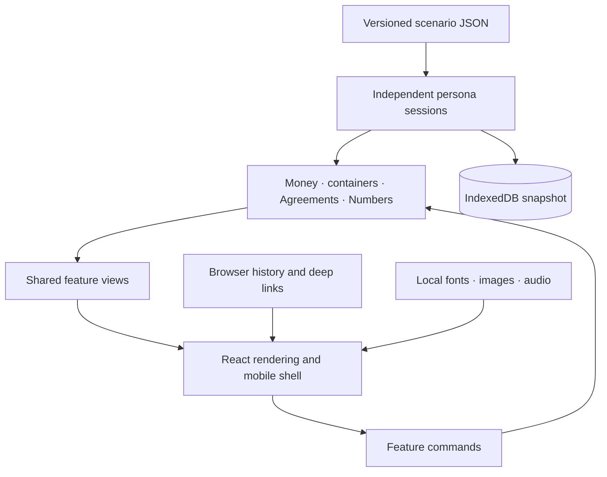

# Migration architecture

## One model, several expressions

The migration preserves the agreed model: **Agreement → Conditions → fulfilment mechanisms → benefit**. Money Rules help fulfil suitable conditions. Manual payments use the same receipt evidence. Pausing a rule does not itself breach an Agreement. Choices, locks, repayment plans and invested-capital conditions remain distinct mechanisms. Number cards, detail views, the How it works sheet and AI read the same derived container/Agreement model.

## Boundaries

| Layer | Responsibility | Deliberately excluded |
|---|---|---|
| `data/` | Authored facts, intelligence, conditions, catalogues, schema | UI layout and device state |
| `src/domain/` | Calculations, evidence, transfers, rewards, undo, benefits and eligibility | DOM and browser APIs |
| `src/features/` | Screens, detail content, commands grouped by product feature | Duplicated financial calculations |
| `src/design-system/` | Shared card/button/avatar/icon templates, React rendering, theme CSS variables | Persona-specific financial decisions |
| `src/app/` | Current session, dialog stack, draft orchestration, event routing | Hosted services |
| `src/platform/` | Saved sessions, navigation, viewport, PWA lifecycle and optional haptics | Product eligibility rules |

The 138 existing action commands are grouped into nine handlers: pots, support, actions, accounts, future, payments, profile, numbers and navigation. `command-inventory.json` maps them. Commands keep the original review/confirmation steps. Nested command calls are preserved; browser routing only replays navigation commands and never payment confirmations.

## React compatibility boundary

`Markup.tsx` converts the existing escaped feature templates into React elements. It is not `dangerouslySetInnerHTML` and does not run an old HTML export. `renderRegion` updates named regions; React preserves element identity. Controlled region updates retain audio, focus and active controls. Restored dialogs serialise form values and restore scroll/focus, rather than retaining detached DOM nodes.

Modal interaction ownership must also be released explicitly. Every main-screen `render()` clears the modal stack and calls `setModalOwnership(false)` before support initialisation: reused DOM nodes can otherwise retain imperative `inert` attributes even after React removes the sheet. This applies to scenario changes, reset, theme changes and completed Story actions as well as ordinary Close. Cleanup removes the phone's dialog semantics across themes. Nested sheets still preserve and restore their underlying ownership; support and the demo menu manage their own visibility locks. `e2e/interaction-ownership.spec.ts` checks these return paths with real clicks and desktop wheel scrolling in both browser engines.

The original domain modules remain JavaScript ES modules under `src/domain/`. Feature views remain template functions under `src/features/`, with commands separated from them. The app controller still coordinates some DOM-based interactions. TypeScript checks the new shell and platform layer; ESLint checks unresolved bindings throughout the migrated JavaScript. **This is a contained compatibility layer, not a completed line-by-line JSX/TypeScript rewrite.**

This choice allowed the entire experience to move without recreating a reduced subset or simultaneously changing product behaviour. New work should use typed components where practical. Replace a legacy feature boundary as one bounded change, keeping the same data model, action contracts, workbench cases and interaction tests. Do not add a second financial state store alongside the existing one.

## Reusable components and tokens

`templates.mjs` owns the shared Number card, button, rows and avatar helpers; `icons.mjs` owns Material paths. Pot/account details and agreements share the views in `features/pots/`; Now and pot More share action configuration and editor behaviour. Workbench specimens import these same functions.

CSS custom properties are the canonical token interface: `--ink`, `--muted`, `--canvas`, `--surface`, `--line`, `--soft`, `--action`, `--on-action`, `--focus`, radii and motion. Foundations define defaults, direction/theme files refine them, and feature files define component geometry. Import order is explicit in `main.tsx`. Existing cascade decisions were retained to preserve all three directions, then formatted for review. Avoid copying colour values into new features; use semantic tokens. Number containers keep the same neutral surface; icons distinguish pots and insights.

## State and persistence

The seed files are copied into four independent sessions. Domain transactions preserve ledger evidence and support Undo. UI drafts remain temporary until the existing Done/Review/Confirm action. IndexedDB stores a versioned JSON session snapshot after actions. It is scoped to the device and origin, not synced across phones.

A schema/version mismatch or malformed snapshot starts from the current seed. Storage failure falls back to a usable in-memory demo. Reset affects the selected persona; reload normally preserves changes. Audio progress is an active media session, not a persisted promise to resume playback after a reload. There is no hosted database, authentication, actual Open Banking connection, payment service or live AI service.

## Navigation and motion

Top-level links accept `?p=sam&tab=future&theme=vanilla` and `/app/sam/future`. Legacy edition/workbench URLs resolve through the same app. In-app sheets keep their original parent, drafts, scroll and focus. Browser history stores small view descriptors, never the financial session. Replay is restricted to navigation actions.

Mobile uses the real viewport and safe-area insets; desktop keeps the stakeholder frame. Keyboard-aware viewport sizing keeps the composer reachable. Sheet motion uses transforms and honours reduced motion. Browser haptics use the shared [haptic language](HAPTIC-LANGUAGE.md), with outcome-based cues and central repetition limits. Supported touch devices default to on unless a saved preference or Reduced Motion disables it. Full native haptics and platform-native navigation require a later native wrapper; no iOS/Android package has been created here.

## Delivery

Vite produces one static app with hashed JavaScript/CSS and independently loaded local media. A versioned service worker caches the app shell, scenario JSON and assets. A waiting release offers Save & restart; it does not reload an active task automatically. HTTPS is needed for the hosted PWA. The deployment guide covers routes, headers and rollback.
