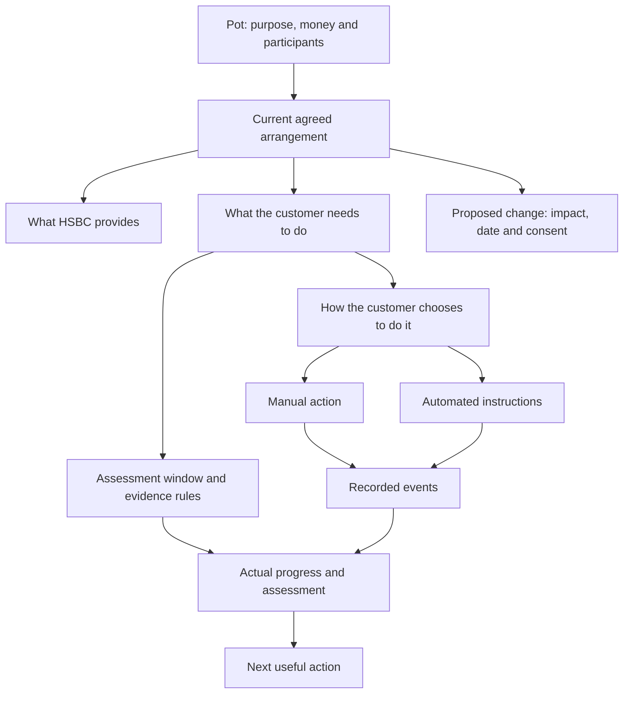

# Pots: one experience for money with a purpose

Design rationale · 9 September 2026 · Fulfilment model clarified and implemented

The user confirmed that Money Rules are optional fulfilment methods and that an agreement can combine several different kinds of condition. The implementation now follows this model; see POTS-ACCOUNTS-SYSTEM.md for current behaviour and example terms. The original proposal below records the design reasoning. Missed-condition recovery and repricing policies remain open.

## The problem to solve

The customer is trying to understand one arrangement: “What is this money for, how is it doing, what do I get, and what do I need to do next?”

The current implementation instead asks them to understand a pot, a rate card, an agreement, attached rules and links between them. Repeating the rate and adding badges makes the relationship more visible but leaves that organisational burden with the customer.

There is also a model error: `agreementCondition` currently infers eligibility from enabled schedules. A schedule is an intention. A successful payment is evidence. An agreed rate is an entitlement. They are not interchangeable. Disabling a payment cannot undo money that already arrived, and enabling one cannot prove a contribution has happened.

Sam’s source scenario illustrates this distinction: the snapshot is 8 September; the house-pot ledger records a £320 contribution on 28 August. That supports a statement about the last contribution. It does not establish a September assessment result or a future payment’s success. “Eight months kept” is a source assertion in the existing terms, not eight months of independently evaluated transaction evidence.

## The customer’s mental model

**My pot has a purpose, a way of working, and a history.**

- **Purpose:** what I am saving for, spending on, repaying or investing towards.
- **Way of working:** what HSBC provides, what is expected of me, and how I have arranged to do it.
- **History:** what actually happened to my money and this arrangement.

The pot is the primary object. Rules and agreements are concepts underneath it. Customers can still inspect and control them, but should not need to navigate between separate feature areas to answer a simple question.

A useful default sentence is: **“You receive X. Do Y by Z. Here is your progress and the next step.”**

When there is no conditional benefit, omit the condition. When the money is invested, state risk and charges rather than inventing a promised return. When there is debt, distinguish the cost of borrowing from the payment obligation.

## Domain model

| Part | Responsibility | Must not be confused with |
| --- | --- | --- |
| Container | Stable identity, institution, value, currency and ledger | A widget or a product label |
| Purpose | Goal, spending intention, repayment aim or investment horizon | A contractual requirement |
| Participation | Owners, contributors, viewers and authority to change the arrangement | A separate “shared pot” financial type |
| Arrangement | The version of the terms accepted for this container | A collection of linked rule IDs |
| Bank commitment | Current rate, cashback, fees, access and other applicable benefits | A projected or proposed benefit |
| Customer condition | Measurable obligation, assessment window, eligible evidence and exceptions | An automated instruction |
| Fulfilment method | Manual action, one or more automated instructions, or a combination | Proof the condition has been met |
| Assessment | Evidence-backed progress, remaining obligation and the next decision date | A forecast based on enabled instructions |
| Change proposal | What would change, when, why, and which consent is needed | A change already in force |
| Event history | Transfers, execution outcomes, earned rewards, accepted terms and membership changes | Repeated status messages |

### Relationships



A rule can serve several purposes, and several rules can fulfil one condition. The relationship belongs to the condition and its evidence policy, not a decorative badge connecting two cards.

## Two independent kinds of state

**What applies now** and **what needs attention next** must remain separate.

| Situation | Current benefit | Progress / next action |
| --- | --- | --- |
| Contribution received, future automation paused | Remains the currently agreed benefit | Explain that future funding needs another method |
| Contribution not yet due, payment scheduled | Remains current | “Scheduled”; do not say “condition met” |
| Payment fails before the deadline | Remains current unless explicit terms say otherwise | Explain the shortfall and offer another payment method |
| Deadline approaching with a shortfall | Current benefit plus clear prospective consequence | Specific amount, deadline and “Add money” or “Change payment” |
| Condition met manually | Same treatment as qualifying automated evidence | “Complete” with the payment that fulfilled it |
| Assessment incomplete or data missing | Show the last known effective terms | “Checking” or “Not yet assessed”; never imply failure |
| A benefit change has been agreed/notified under the terms | Show both effective dates clearly | Current terms until the change takes effect; then new terms |

The warning, recovery and effective-date policy is pending the user’s decision. No grace period, fallback rate or retroactive penalty should be silently invented for the demo.

## A new screen composition

Preserve the established detail header, compact AI support, large balance and Now-style circular actions. Replace the separate agreement card, benefit badges and attached-rule card collection with one section: **How this pot works**.

The structure is:

1. **Header and contextual AI.** AI highlights an opportunity or action; it does not repeat the complete arrangement.
2. **Money and purpose.** Balance with the appropriate type. Target or allowance uses the same evidence as elsewhere. Participants appear here for shared pots.
3. **Immediate actions.** Existing circular controls for add/repay, move and other relevant tasks.
4. **How this pot works.** A single composed surface containing the benefit, customer commitment, actual progress and fulfilment method in that order.
5. **Activity.** Actual money and arrangement events, with filters where useful.

### Inside “How this pot works”

**One benefit headline**, rather than the same rate repeated in the hero, mini card, rule badge and rule detail.

Under it, place a clear human commitment: “Add £320 each month.” Show progress only when the assessment window and evidence are defined. Place the method immediately beneath that commitment: “Automatically from HSBC Current on payday.” The method is an actionable row, not another self-contained benefit card.

End with a quiet **View agreement** text action opening the full terms in a bottom sheet. Formal agreement detail remains available without carrying the whole explanatory task on the main screen.

A second optional instruction, such as round-ups, is a secondary row in the same surface, grouped by what it does for this pot. It does not get a redundant rate badge. A pot with several conditions has one row per condition, each with its evidence and method. Expand the relevant row for controls; do not show all configuration fields at once.

### Illustrative composition for Sam

```text
House deposit
[compact contextual AI]

£6,400                         Savings pot
Towards your £24,000 deposit
[goal progress]

Add money   Move money   Edit goal   More

How this pot works
┌────────────────────────────────────────┐
│ 5.1%                                   │
│ Your agreed savings rate               │
│                                        │
│ Add £320 each month                     │
│ Last contribution: £320 · 28 Aug        │
│                                        │
│ ↻ On payday from HSBC Current       ›   │
│   £320 automatically                   │
│                                        │
│ View agreement                      ›   │
└────────────────────────────────────────┘

Activity
28 Aug · £320 added on payday
...
```

This uses the actual snapshot evidence. The eventual progress treatment needs an agreed assessment period; this sketch deliberately does not assert “September complete”. Typography, whitespace and one coherent surface establish the relationship. Arrows and dividing rules are restrained; there are no new badges to decode.

## One management experience

Tapping a method opens **Manage how you contribute**. The existing arrangement summary remains visible while the user adjusts fulfilment. There are two distinct choices:

- **Change the payment:** amount, source, timing, pause, resume, remove, or pay manually. Evaluate the effect on future fulfilment. Preserve evidence and terms already earned/agreed.
- **Change the commitment:** request a different arrangement with HSBC. Show the proposed benefit, conditions and effective date together before acceptance. Do not silently renegotiate the agreement by editing a transfer.

Reviews focus on the user’s outcome, for example: “£100 will be automatic. You will need to add the remaining £220 yourself.” If this month is already complete, say so. Avoid a blanket “Your rate needs review” solely because a toggle changed.

When a particular offer explicitly requires automatic funding, state that in the original commitment. The review can then explain the specific consequence of disabling it. That is an offer variation within the model, not a different UI system.

For shared pots, identify whose method is being edited. One participant must not be able to change another person’s instruction or the household agreement without the appropriate authority and consent.

## Consistency across the product

| Surface | What it should communicate |
| --- | --- |
| Small Number | Amount, purpose, one meaningful current status |
| Wide Number | Same information, plus the next obligation or relevant progress |
| Accounts & pots | Identity, amount and concise benefit/status; no miniature management UI |
| Pot detail | The complete story of money, arrangement, progress and method |
| Management sheet/journey | Adjust the method or request different terms; preserve the context |
| Global Money Rules | Portfolio overview of instructions, grouped by the purposes they serve; opens the same management experience |
| Agreement sheet | Full accepted terms, versions, dates, qualifying evidence, change policy and participants |
| AI | Explains the same derived state and offers a useful action; does not create an independent interpretation |
| Activity | Evidence of payments and the history of accepted changes; no synthetic “payments” from configuration edits |

All surfaces consume one presentation model. They must not separately infer eligibility or build personalised benefit copy from pot IDs.

## Variations without separate feature systems

| Variation | Bank commitment / economics | Customer commitment | Typical method |
| --- | --- | --- | --- |
| Savings | Personalised rate and access | Contribution or balance conditions, where applicable | Manual or automated saving |
| Shared savings | Same, with agreed participation scope | Household aggregate or named-member conditions, explicitly defined | Each participant’s authorised method |
| Budget wallet | Cashback and eligible-spend terms | Funding/spending conditions for the period | Payday funding and optional monitoring |
| Credit / loan | Borrowing rate, fees, payment terms | Minimum or agreed repayment and due date | Direct debit, scheduled repayment, manual payment |
| Investment | Allocation, charges, access and risk | Chosen contribution plan, where applicable | Contributions plus separately authorised trades |
| Unconditional account | Effective product terms | No invented behavioural commitment | Optional personal money moves |
| Connected account | Source-bank facts available through consent | No HSBC-controlled agreement asserted | Read-only unless a capability is explicitly supported |

Savings → investment revises the arrangement, not just the type label. Review rates ending, investment risk, charges, access and any methods that no longer apply. Preserve the container’s identity and history. Personal → shared revises participation and authority; it does not automatically transfer control of every instruction.

## Product decisions before implementation

### Asked now

1. **Evidence versus automation.** Recommended: benefits usually depend on actual behaviour, manual or automated. An offer may explicitly require automation, but enabled schedules are not the default qualification test.
2. **Missed-condition policy.** Recommended: advance notice, a chance to remedy, then a clear benefit change and effective date under agreed terms. Specific periods and replacement rates remain to be defined.

### Parameters to make explicit in the chosen prototype examples

- Assessment windows: calendar month, payday cycle or another period; what counts as a qualifying deposit; whether withdrawals offset contributions.
- Shared conditions: household total versus individual commitments. Recommendation: a household goal with clearly attributed contributions; only the authorised owner changes shared terms.
- A fixed rate’s meaning: fixed for which term, what exceptional changes can occur, and whether a fallback rate was accepted at opening. “Fixed while committed” is insufficient on its own.
- Borrowing: failure to pay is a contractual event, not equivalent to losing optional cashback. The prototype should not invent a generic penalty policy.
- Current personalised rates are illustrative scenario data. Their presence does not demonstrate a pricing engine or a real personalised offer.

These are explicit model parameters, not reasons to add more visible UI. Unresolved parameters should remain unresolved in the demo rather than be presented as facts.

## Implementation after the decisions

Replace the schedule-based eligibility adapter with an arrangement/evidence model. Keep existing balances and recorded payments; add explicitly labelled demonstration events only for state previews. Build a single composed “How this pot works” component and one management flow from that model. Remove the overlapping agreement, linked-benefit and rule-card treatments they replace.

Start with Sam’s savings arrangement and a counterexample—Elena’s shared pot or Jordan’s wallet—to verify the model is not tailored only to a fixed monthly payment. Review the visual composition and flow at that point, then apply the same components to the remaining types and Number sizes.

Acceptance cases must include payment already received before automation is paused, manual fulfilment, multiple contributing methods, a failed future payment, missing evidence, prospective benefit change, cancellation without mutation, and authority in a shared pot. Existing support, navigation, money-conservation and offline behaviour remain required.
